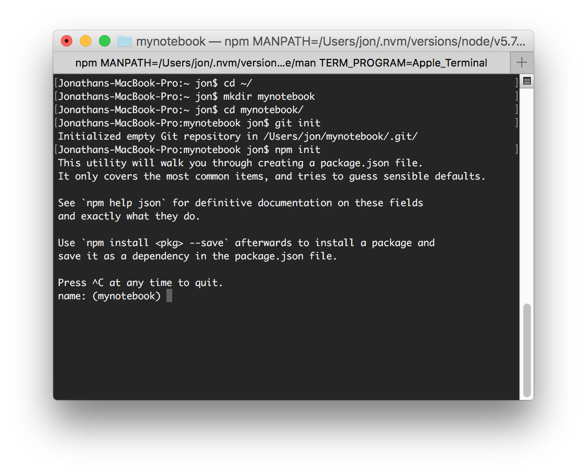

# Writing Your Own Notebook with Remote Compute

Interactive data exploration is essential for data science, quantitative finance,
physics, and many other high tech markets.  An increasingly popular way to 
interact with data is is to use an interactive notebook.  There are
many notebook implementations available today.  Before you decide to write your
own notebook like application, you should investigate the existing
implementations.  There's a good chance that an implementation already exists
which meets your needs or that modifying an existing implementation will also
suffice.  For a list of existing notebook implementations, see 
[Appendix A](#appendixA).

For those not familiar with the notebook model concept, a notebook is a document
that mixes narrative content with programming code.

This tutorial describes how an Electron based interactive notebook application
is written.  It's closely modeled after the ideas used in the nteract notebook.
nteract technologies will be used to simplify the implementation.

### Requirements

Before continuing, the following software is required:

- [Node 4.x or 5.x](https://nodejs.org/en/download/)
- npm 3.x (should be included in the node installer)
- [git 2.x](https://git-scm.com/)

To check if you have these installed and that they are the correct versions, run

```bash
node -v
npm -v
git --version
```

This tutorial was developed bot on Linux and OSX computers.  Optionally, you can
install the [atom editor](https://atom.io/) which is the text editor used in
this tutorial.

### Prepare project

First, open up your terminal and create and navigate into a directory for the
your new project's source code.  Here I create one in my home directory.

```bash
cd ~/
mkdir mynotebook
cd mynotebook
```

Now initialize the directory as a git project.

```bash
git init
```

Next initialize the directory as an npm package.  You can do this using the
wizard included with npm.

```bash
npm init
```

You should see the following



If you want, you can enter information about your project, like its name and
description as the wizard prompts for that info.  Otherwise you can accept all 
of the defaults by hitting return multiple times until the wizard exits.  You
can change these settings later by editing the `package.json` file that the
wizard will create for you.

### Get electron working

The next step is to setup the project as an 
[electron app](http://electron.atom.io/).  First electron must be installed

```bash
npm i electron-prebuilt@^0.36.2 --save
```

"Wait, this command looks cryptic!  What's going on here?"
`npm i` is shorthand for `npm install`.  `npm i` will be used throughout the
rest of the tutorial to save characters.  `electron-prebuilt` is the name of the
[npm package](https://www.npmjs.com/package/electron-prebuilt) that contains the
electron interpreter.  The `@^0.36.2` tells npm to install the major revision
that this tutorial uses.  Lastly `--save` tells npm to install the package
as a runtime dependency so that it gets installed automatically along with your
package.

Because modern web technology is awesome, we'll opt in to using Javascript ES6
instead of ES5.  To do so, install electron-compile

```bash
npm i electron-compile@^2.0.4 --save
```

Electron compile will automatically
[transpile](https://www.google.com/webhp?sourceid=chrome-instant&ion=1&espv=2&ie=UTF-8#q=define%3A%20transpile)
the ES6 Javascript we use into
ES5 Javascript.

**TODO: Briefly mention render/main thread of electron
**TODO: Create entry point folders/files**

### Understand the notebook model

**TODO: Rewrite this bit**
The first step in designing a notebook application is to design a notebook
model.  To simplify the tutorial, our notebook model will be a linear array of
"cells", where each cell can either be a code cell or text cell.  This is the
same model that [nteract](https://github.com/nteract/nteract) uses, so you will
be able reuse nteract's document manipulation library,
[commutable](https://github.com/nteract/commutable).  Don't worry about the
details yet, you'll learn about the libraries later in the tutorial.

### Overview of nteract technologies
### Install redux
### Load a notebook (commutable)
### Launch a kernel (spawnteract)
### Execute code and display results (enchannel)
### Save the notebook (commutable)
### Conclusion

### Appendix A <a name="appendixA"></a>
- [nteract](https://github.com/nteract/nteract)
- [Jupyter Notebook](https://github.com/jupyter/notebook)
- [Jupyter Lab](https://github.com/jupyter/notebook)
- [SageNB](http://www.sagenb.org/)
- [Beaker Notebook](http://beakernotebook.com/)
- [Apache Zeppelin](https://zeppelin.incubator.apache.org/)
